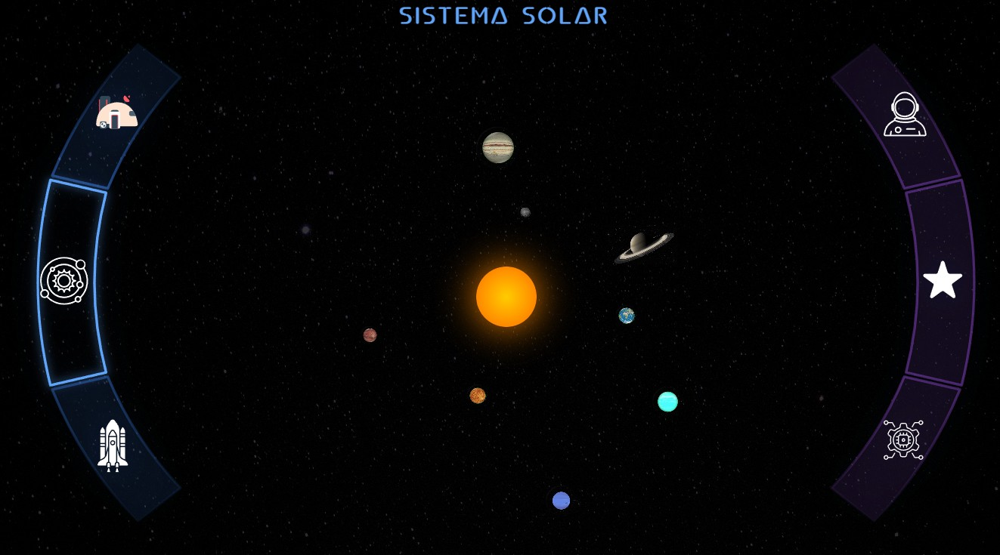
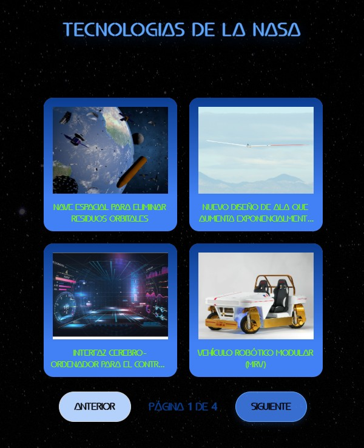

# 🚀 Universia

> Aplicación SPA desarrollada con Angular que combina exploración espacial, autenticación de usuarios y gestión personalizada de contenido mediante integración con APIs públicas.

## 🎬 Demo

---

## 🌌 Visión General

Universia es una aplicación desarrollada con Angular que permite explorar información relacionada con el espacio a través de diferentes fuentes de datos externas.

Los usuarios pueden consultar información sobre planetas del Sistema Solar, lanzamientos espaciales de SpaceX y tecnologías de la NASA, además de guardar contenido favorito mediante autenticación de usuario.

---

## ✨ Características Principales

### 🌍 Exploración del Sistema Solar

* Visualización interactiva de los planetas.
* Navegación dinámica entre vistas.
* Consulta de información detallada de cada planeta.

### 🚀 Lanzamientos Espaciales

* Consumo de datos desde APIs públicas.
* Acceso a información de misiones espaciales.
* Enlaces externos relacionados con cada lanzamiento.

### 🛰️ Tecnologías de la NASA

* Consulta de tecnologías y proyectos publicados por la NASA.
* Visualización dinámica de información obtenida desde API.

### ⭐ Sistema de Favoritos

* Guardado de elementos favoritos.
* Persistencia de datos asociada al usuario autenticado.
* Gestión personalizada de contenido.

### 🔐 Autenticación

* Registro e inicio de sesión mediante Firebase Authentication.
* Protección de funcionalidades privadas.
* Control de acceso mediante Guards.

---

## 📸 Capturas

### 🌍 Sistema Solar

### 🔐 Autenticación

### 🛰️ Tecnologías NASA

---

## 🏗️ Arquitectura

* Standalone Components
* Angular Router
* Lazy Loading
* Reactive Forms
* Guards
* Http Interceptors
* Servicios desacoplados
* Gestión reactiva con RxJS
* Integración con Firebase

---

## 🧰 Stack Tecnológico

### Frontend

* Angular
* TypeScript
* RxJS
* Angular Router
* Reactive Forms

### Backend & Cloud

* Firebase Authentication
* Firestore

### APIs

* NASA APIs
* SpaceX APIs
* le-systeme-solaire APIs

### Estilos

* HTML5
* CSS3
* Tailwind CSS

---

## 🎯 Objetivos del Proyecto

Este proyecto fue desarrollado para profundizar en conceptos avanzados de Angular:

* Consumo de APIs REST.
* Gestión de autenticación.
* Protección de rutas.
* Persistencia de datos.
* Arquitectura modular escalable.
* Desarrollo de aplicaciones SPA modernas.

---

## 🚀 Live Demo

https://universia-haxe.netlify.app

---

## 👨‍💻 Autor

Álvaro Martínez Sagristá

Frontend Developer especializado en Angular
